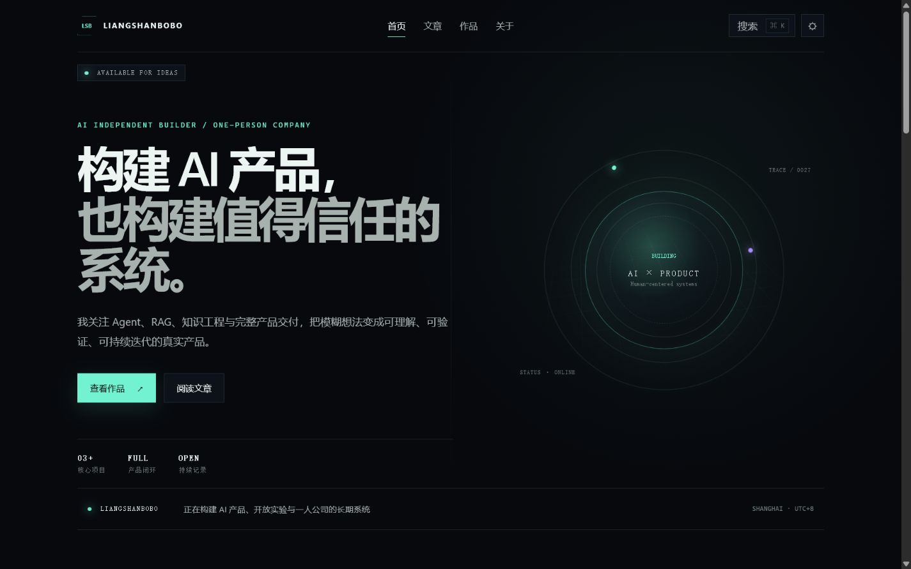

# Liangshanbobo

> Liangshanbobo 的开源个人网站与公开构建基地：承载作品、文章、实验和一人公司的长期品牌。

<p align="center">
  
</p>

<p align="center">
  <strong>React 19 · Vite 8 · TypeScript · React Router</strong><br />
  AI 科技感视觉、Markdown 内容系统、静态预渲染与清晰的公开模板 / 私人实例边界
</p>

<p align="center">
  <a href="#当前功能">功能</a> ·
  <a href="#本地开发">本地开发</a> ·
  <a href="#公开模板与私人网站">维护架构</a> ·
  <a href="CONTRIBUTING.md">参与贡献</a>
</p>

**项目状态：** 开源网站可本地运行和构建；正式在线演示待域名、ICP备案与国内部署链路完成后开放。本仓库不会用本地预览冒充线上 Demo。

项目使用 React、Vite、TypeScript 与 React Router Framework Mode。内容页面会在构建阶段预渲染为独立 HTML，适合部署到腾讯云 COS、CloudBase、CDN 或其他静态托管平台。

本仓库定位为公开的网站模板与核心代码。建议把真实个人网站维护在独立私有仓库中，并将本仓库配置为 `upstream`：社区贡献进入公开模板，个人资料、未发布文章与部署配置留在私有实例。

## 当前功能

- AI 科技感响应式首页
- 文章归档与 Markdown 正文
- 作品集和项目摘要
- 关于与经历页面
- 明暗主题切换
- 全局命令面板
- 静态预渲染和路由级 SEO 元信息
- 移动端布局与 reduced-motion 支持

## 本地开发

要求 Node.js 22 或更高版本。

```bash
npm install
npm run dev
```

默认开发地址为 `http://localhost:5173`。

## 验证与构建

```bash
npm run typecheck
npm run build
```

静态文件输出到 `build/client`。文章、项目和其他公开页面应在部署前全部出现在构建日志的 `Prerender` 列表中。

## 内容维护

文章保存在：

```text
app/content/articles/*.md
```

每篇文章包含以下 frontmatter：

```yaml
---
title: "文章标题"
summary: "文章摘要"
publishedAt: "2026-07-13"
readingTime: "8 min"
tags: ["React", "AI"]
featured: false
---
```

公开示例配置位于 `app/data/site.config.example.json`。实际生效的本地配置是 `app/data/site.config.json`，不会被 Git 跟踪。

## 个性化清单

运行 `npm run dev`、`npm run setup`、`npm run build` 或 `npm run typecheck` 时，项目会在本地配置不存在的情况下自动从示例创建它。之后可在 `/setup` 或直接编辑 `app/data/site.config.json`，集中替换：

- 姓名、品牌首字母、职业定位和默认 SEO 描述
- 邮箱与 GitHub 地址
- 首页个人定位、当前状态与关键信息
- 关于页的简介与技能
- 页脚文案

项目和经历也保留在同一文件。示例配置可以安全提交到公开仓库；真实配置与本地历史不会被 Git 跟踪。之后再替换照片，并在域名确定后补齐 canonical、Open Graph、Sitemap 和 RSS 地址。

### 本地配置向导

不想手动编辑 JSON 时，启动开发服务器：

```bash
npm run dev
```

然后打开 `http://localhost:5173/setup`。向导仅在本地开发时可用，可以编辑当前配置、创建和切换命名方案，并在每次保存、切换或恢复前自动生成历史快照。`npm run setup` 仍可作为启动同一开发环境的快捷命令。

活动配置仍保存在 `app/data/site.config.json`，是唯一会参与生产构建的配置文件，但默认被 Git 忽略。公开仓库只提交 `app/data/site.config.example.json`；其他方案与历史快照保存在 `.portfolio-config/`，同样不会被跟踪或部署到网站。

## 公开模板与私人网站

推荐使用两个边界清晰的仓库：

```text
liangshanbobo（公开）          →  个人品牌、组件、主题、博客引擎、示例内容
liangshanbobo-private（私有）  →  未发布内容、私密资料、部署配置
```

在私人网站仓库中添加本项目作为上游：

```bash
git remote add upstream https://github.com/liang0417/liangshanbobo.git
git fetch upstream
git merge upstream/main
```

不要把 API Key、部署令牌或其他秘密放进 React/Vite 前端。以 `VITE_` 开头的变量会进入浏览器构建结果，不适合保存秘密；需要密钥的能力应由服务端接口代理，并配置鉴权、限流与配额。

## 中国大陆部署路线

推荐链路：

```text
GitHub → CI 构建 → build/client → 腾讯云 COS/CloudBase → 国内 CDN → 已备案域名
```

域名、ICP备案、HTTPS 和 CDN 尚未在本仓库中配置。不要在没有真实线上验证的情况下宣称部署完成。

## 开源与内容版权

程序代码使用 [MIT License](LICENSE)。文章、个人简历、照片、项目描述和个人品牌素材不随代码使用 MIT 授权，详见 [CONTENT_LICENSE.md](CONTENT_LICENSE.md)。

参与开发前请阅读 [CONTRIBUTING.md](CONTRIBUTING.md)，安全问题请按 [SECURITY.md](SECURITY.md) 的方式报告。
